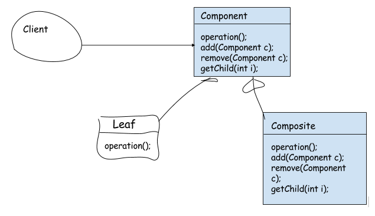

#1 组合模式  
##1.1 概述  
&emsp;&emsp;对于树形结构，当容器对象（如文件夹）的某一个方法被调用时，将遍历整个树形结构，寻找也包含这个方法的成员对象（可以是容器对象，也可以是叶子对象）并调用执行，牵一而动百，其中使用了递归调用的机制来对整个结构进行处理。由于容器对象和叶子对象在功能上的区别，在使用这些对象的代码中必须有区别地对待容器对象和叶子对象，而实际上大多数情况下我们希望一致地处理它们，因为对于这些对象的区别对待将会使得程序非常复杂。组合模式为解决此类问题而诞生，它可以让叶子对象和容器对象的使用具有一致性。

##1.2 定义  
&emsp;&emsp;组合多个对象形成树形结构以表示具有“整体—部分”关系的层次结构。组合模式对单个对象（即叶子对象）和组合对象（即容器对象）的使用具有一致性，组合模式又可以称为“整体—部分”(Part-Whole)模式，它是一种对象结构型模式。在组合模式中引入了抽象构件类Component，它是所有容器类和叶子类的公共父类，客户端针对Component进行编程。如图所示：  
  

- **抽象构件(Component)**： 它可以是接口或抽象类，为叶子构件和容器构件对象声明接口，在该角色中可以包含所有子类共有行为的声明和实现。在抽象构件中定义了访问及管理它的子构件的方法，如增加子构件、删除子构件、获取子构件等。

```Java
package xyz.hrui.combination;

/**
 * 构件接口，客户端直接针对该接口编程，不需要知道其实现类具体实现
 * @author huangrui
 * @date 2016-12-21
 */
public interface Component {
	void add(Component c);
	void remove(Component c);
	Component getChild(int i);
	void operation();//具体业务方法
}

```
- **叶子构件（Leaf）**：它在组合结构中表示叶子节点对象，叶子节点没有子节点，它实现了在抽象构件中定义的行为。对于那些访问及管理子构件的方法，可以通过异常等方式进行处理。

```Java
package xyz.hrui.combination;

import org.slf4j.Logger;
import org.slf4j.LoggerFactory;

/**
 * 叶子构件，作为叶子节点是应该只能有具体的业务操作方法
 * 			而管理来其子节点的方法应该给予异常提示（不允许添加或删除）
 * @author huangrui
 * @date 2016-12-21
 */
public class Leaf implements Component {

	private static Logger log = LoggerFactory.getLogger(Leaf.class);

	@Override
	public void add(Component c) {
		log.error("不支持添加节点");
	}

	@Override
	public void remove(Component c) {
		//异常信息处理
		log.error("不支持添加节点");
	}

	@Override
	public Component getChild(int i) {
		//异常信息处理
		log.error("不支持添加节点");
		return null;
	}

	@Override
	public void operation() {
		// 业务方法
	}

}

```
- **容器构件（Composite）**：它在组合结构中表示容器节点对象，容器节点包含子节点，其子节点可以是叶子节点，也可以是容器节点，它提供一个集合用于存储子节点，实现了在抽象构件中定义的行为，包括那些访问及管理子构件的方法，在其业务方法中可以递归调用其子节点的业务方法。  

```Java
package xyz.hrui.combination;

import java.util.ArrayList;
import java.util.List;

/**
 * 容器节点
 * @author huangrui
 * @date 2016-12-21
 */
public class Composite implements Component {

	private List<Component> children = new ArrayList<>();

	@Override
	public void add(Component c) {
		children.add(c);
	}

	@Override
	public void remove(Component c) {
		children.remove(c);
	}

	@Override
	public Component getChild(int i) {
		return children.get(i);
	}

	@Override
	public void operation() {
		for (Component element : children) {
			element.operation();
		}
	}

}

```
