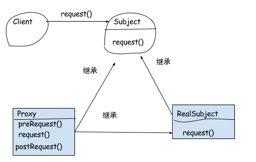

##1 代理模式  
&emsp;&emsp;为了避免客户直接和服务进行通信，可以在其中加上一个代理层，让客户和代理对话，代理和服务对话。代理模式主要由客户、代理、服务，为了让客户不区分代理和服务，所以在中间加上抽象层(Subject)。结构图如下所示：  

    
- 抽象主题(Subject)：声明代理对象和真是对象的共同接口  
- 代理主题(Proxy)：它包含了对真实主题的引用，从而可以在任何时候操作真实主题对象；在代理主题角色中提供一个与真实主题角色相同的接口，以便在任何时候都可以替代真实主题；代理主题角色还可以控制对真实主题的使用，负责在需要的时候创建和删除真实主题对象，并对真实主题对象的使用加以约束。通常，在代理主题角色中，客户端在调用所引用的真实主题操作之前或之后还需要执行其他操作，而不仅仅是单纯调用真实主题对象中的操作。  
- 真实主题(RealSubject)：它定义了代理角色所代表的真实对象，在真实主题角色中实现了真实的业务操作，客户端可以通过代理主题角色间接调用真实主题角色中定义的操作。  

##1.1 简单代码  
抽象主题：可以是具体类、抽象类或者接口。  
```Java
public Interface Subject{
    Object request();
}
```  
真实主题实现了抽象主题  
```Java
public class RealSubject implements Subject{
    @Override
    public Object request(){
        //...
    }
}
```   

代理类也是抽象主题类的子类，它维持一个对真实主题对象的引用，调用在真实主题中实现的业务方法，在调用时可以在原有业务方法的基础上附加一些新的方法来对功能进行扩充或约束，最简单的代理类实现代码如下：  
```Java
public class proxy implements Subject{
    //对真实对象引用
    private RealSubject realSubject = new RealSubject();

    @Override
    public Object request(){
        preRequest();
        //调用真实方法的request();
        return realSubject.request();
    }

    public void preRequest(){

    }
}
```
